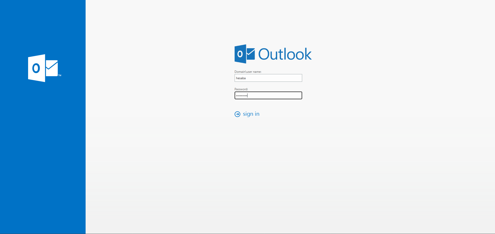
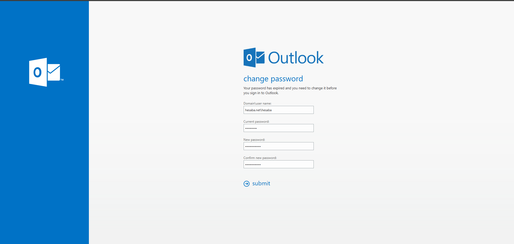
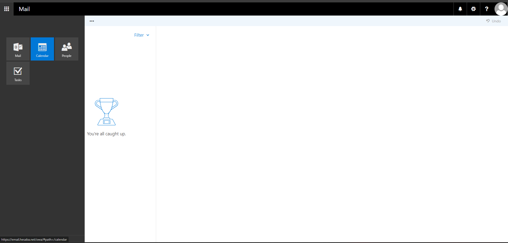
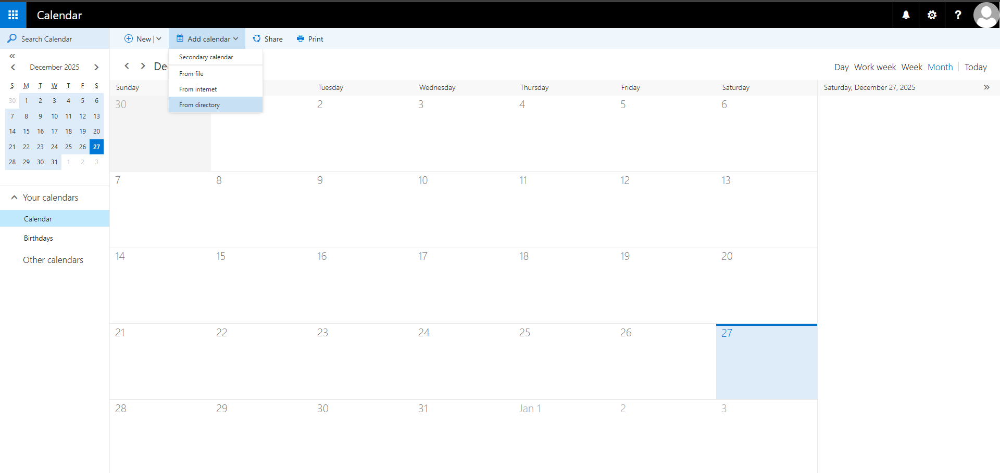
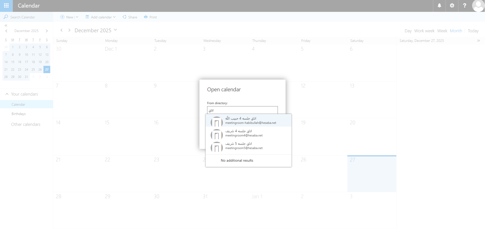

# راهنمای ورود به ایمیل سازمانی و اضافه کردن تقویم (Exchange Server 2019 / OWA)

این راهنما برای کاربران سازمان تهیه شده تا:
- وارد Outlook Web App (OWA) شوند
- تقویم (Calendar) همکاران/اتاق‌های جلسه را از Directory اضافه کنند

---

## پیش‌نیازها
- آدرس وب‌میل: `https://email.hesaba.net`  
  (آدرس دقیق را از واحد IT دریافت کنید)
- نام کاربری و رمز عبور سازمانی

> - `DOMAIN\username`
> - `username`
> - `username@hesaba.net`

---

## ۱) ورود به صفحه وب
1) مرورگر را باز کنید و آدرس وب‌میل را وارد کنید.  
2) در صفحه ورود، **نام کاربری** و **رمز عبور** خود را وارد کنید و روی **Sign in** بزنید.
3) پسوورد پیش فرص تمامی کاربران Hesaba12345 می باشد که پس از ورود می بایست آن را اغییر دهند.

---

## ۲) تغییر رمز عبور (در صورت نمایش)
اگر پیام تغییر رمز عبور نمایش داده شد (به‌دلیل Expired شدن رمز):
1) **DOMAIN\username** : به این صورت وارد حتما باید وارد شود مثال hesaba.net\hesaba
2) **توجه کنید که پسوورد خود را حتما باید به صورت Complix وارد کنید**
3) **Current password**: رمز فعلی  
4) **New password**: رمز جدید  
5) **Confirm new password**: تکرار رمز جدید  
6) روی **Submit** کلیک کنید.

---

## ۳) رفتن به بخش Calendar
بعد از ورود، از منوی سمت چپ، گزینه **Calendar** را انتخاب کنید.

---

## ۴) اضافه کردن تقویم همکار یا اتاق جلسه (From directory)
1) داخل Calendar، از نوار بالا روی **Add calendar** کلیک کنید.  
2) گزینه **From directory** را انتخاب کنید.

3) در پنجره بازشده، نام همکار/اتاق جلسه را تایپ کنید.  
4) از لیست پیشنهادی، مورد صحیح را انتخاب کنید تا تقویم اضافه شود.

> بعد از اضافه شدن، تقویم معمولاً در بخش **Other calendars** نمایش داده می‌شود.

---

